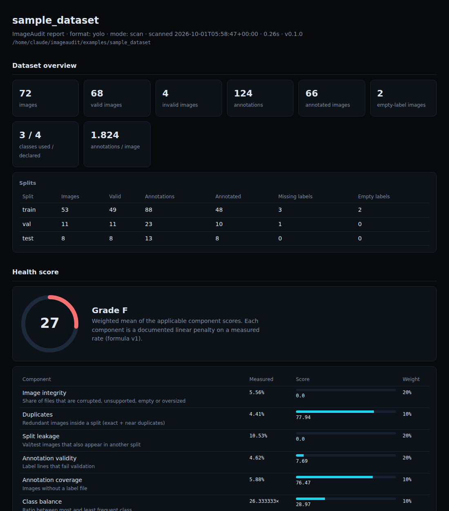
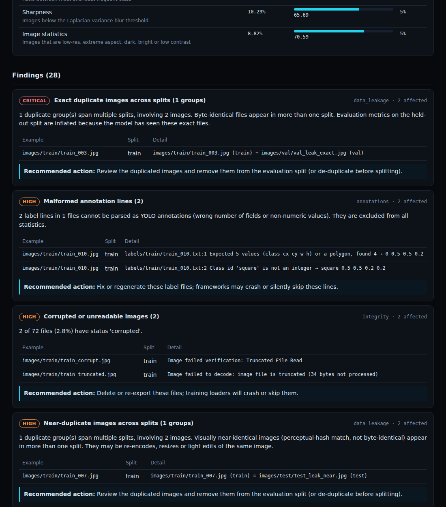

# ImageAudit

**Local-first dataset quality and diagnostics for computer-vision datasets.**


ImageAudit scans a YOLO dataset, finds integrity, quality, annotation, duplicate, and train/val/test leakage problems, scores dataset health with a documented formula, and produces actionable reports (HTML, PDF, JSON, CSV).

Use it from the CLI (including as a CI gate), from Python, or through a local web dashboard. A single-file Windows executable packages the API and the UI so end users need neither Python nor Node.

## Screenshots

HTML report (generated by `imageaudit report` on the bundled sample dataset):




Web UI screenshots are not yet included in the repository.

## Features

- **Image integrity** — corrupt / truncated / zero-byte / oversized files, unsupported extensions and formats, dimensions (EXIF-aware), channels, grayscale
- **Image quality** — blur (Laplacian variance), low resolution, extreme aspect ratio, brightness and contrast statistics, dark/bright images
- **YOLO annotation validation** — malformed lines reported with file and line number; invalid class ids; negative / out-of-range coordinates; zero-area, tiny, huge, out-of-bounds and duplicate boxes; missing / empty / orphan label files
- **Duplicates and leakage** — exact (SHA-256) and perceptual (pHash + dHash) duplicates, classified within-split vs cross-split
- **Transparent health score** — eight weighted components; formula and weights documented and configurable ([docs/health-score.md](docs/health-score.md))
- **Structured findings** — severity, category, title, explanation, affected count, examples, recommended action
- **Reports** — JSON, CSV (four tables), self-contained HTML (no scripts, no network), PDF
- **CLI with CI exit codes**, Python API, FastAPI service, Next.js dashboard
- **Local-first** — dataset files are only read; uploaded archives are extracted with traversal / symlink / size / ratio guards; no telemetry

## Architecture

```text
backend/imageaudit/
  core/          engine, config, security, paths, store, cache
  datasets/      YOLO adapter (extensible DatasetAdapter)
  analyzers/     image integrity, quality, annotations, hashing
  detectors/     duplicates, leakage
  scoring/       health score + findings
  reports/       JSON / CSV / HTML / PDF
  api/           service layer + FastAPI routes
  cli/           imageaudit scan | validate | report | serve
  desktop.py     packaged Windows EXE entry point

frontend/        Next.js 14 App Router UI (static-exported for the EXE)
packaging/       PyInstaller spec, build script, smoke tests
examples/        synthetic sample dataset + example config
docs/            API contract, methodology, health-score formula
```

- The engine is a plain Python library. The CLI and the API call the same `AuditEngine`.
- `api/service.py` holds all API logic (jobs, filtering, thumbnails, reports) so it is unit-testable; `api/app.py` is a thin HTTP shell.
- The packaged EXE serves the static-exported UI from FastAPI on loopback and uses same-origin `/api/...` requests. No separate Node process is required at runtime.

## Supported platforms and formats

| Mode | Platforms |
|------|-----------|
| Source (CLI + API + web UI) | Windows, macOS, Linux (Python 3.11+) |
| Packaged one-file EXE | Windows only (built with PyInstaller on Windows) |

**Dataset formats:** YOLO detection is first-class (`images/<split>/` + `labels/<split>/`, or `<split>/images/` + `<split>/labels/`, optional `data.yaml`). Polygon labels are validated and reduced to boxes. Image formats: JPEG, PNG, BMP, WebP, TIFF.

COCO and classification-folder datasets are not implemented yet.

## Installation and usage

### A. Run from source (development)

**Prerequisites:** Python 3.11+, Node.js 18.18+.

**Windows (PowerShell):**

```powershell
git clone <repository-url> imageaudit
cd imageaudit
.\scripts\dev.ps1 setup
# Terminal 1
.\scripts\dev.ps1 api
# Terminal 2
.\scripts\dev.ps1 web
```

Open http://127.0.0.1:3000. The API listens on http://127.0.0.1:8000.

**macOS / Linux:**

```bash
git clone <repository-url> imageaudit
cd imageaudit
sh scripts/dev.sh setup   # or: make setup
# Terminal 1
make api                  # or: sh scripts/dev.sh api
# Terminal 2
make web                  # or: sh scripts/dev.sh web
```

Manual install (any platform):

```bash
python -m venv .venv
# Windows: .\.venv\Scripts\Activate.ps1
# Unix:    source .venv/bin/activate
pip install -e "./backend[api,dev]"
cd frontend && npm install && cp .env.example .env.local
```

### B. CLI only (no UI)

```bash
pip install -e "./backend[api,dev]"   # or without [api] if you only need scan/validate/report
imageaudit scan path/to/dataset
imageaudit validate path/to/dataset --full
imageaudit report path/to/audit.json -o report.html
```

### C. Packaged Windows EXE

**Build (Windows only; needs Python 3.11+ and Node 18.18+):**

```powershell
.\scripts\dev.ps1 setup
.\scripts\dev.ps1 build-exe
```

Output: `dist\ImageAudit.exe` (approximately 80–85 MB). The build script runs an automated smoke test against the produced binary unless `-SkipSmoke` is passed.

**Run the EXE:**

Double-click `ImageAudit.exe` or run it from a terminal. It binds to `127.0.0.1` (default port 8765), opens the system browser, and serves the UI and API from the same origin.

Persistent data lives under `%LOCALAPPDATA%\ImageAudit` (override with `IMAGEAUDIT_HOME`). Dataset directories are never written to.

**Smoke-test a built binary:**

```powershell
python packaging\smoke_test.py dist\ImageAudit.exe --dataset examples\sample_dataset
```

### D. Docker (optional)

```bash
DATASETS=/path/to/datasets docker compose up --build
```

API on http://127.0.0.1:8000, UI on http://127.0.0.1:3000. Datasets are mounted read-only under `/datasets`; the API only scans paths under that root.

## CLI overview

```text
imageaudit scan DATASET [--config F] [--workers N] [--no-cache] [-o audit.json]
imageaudit validate DATASET [--full] [--fail-on SEVERITY] [--fail-under SCORE]
imageaudit report AUDIT.json [-f html|pdf|json|csv] [-o OUT]
imageaudit serve [--host 127.0.0.1] [--port 8000]
imageaudit demo DEST_DIR
```

`validate` is intended for CI. Default policy fails on any high/critical finding. Example:

```yaml
- run: imageaudit validate data/ --full --fail-on critical --fail-under 80
```

## Python API

```python
from imageaudit import AuditEngine, load_config
from imageaudit.reports.generator import ReportGenerator

result = AuditEngine(load_config("imageaudit.yaml")).run("path/to/dataset")
print(result.health["overall"], [f.title for f in result.findings if f.severity == "critical"])
ReportGenerator().write(result, "html", "report.html")
```

## Configuration

Optional `imageaudit.yaml` in the dataset root (or `--config`). See [examples/imageaudit.example.yaml](examples/imageaudit.example.yaml). Unknown keys are rejected.

Environment variables:

| Variable | Purpose |
|----------|---------|
| `IMAGEAUDIT_HOME` | Writable state directory (audits, thumbs, cache, logs) |
| `IMAGEAUDIT_ALLOWED_ROOTS` | Optional path allow-list for dataset directories (os.pathsep-separated) |
| `IMAGEAUDIT_CORS_ORIGINS` | Comma-separated CORS origins (dev UI) |
| `IMAGEAUDIT_MAX_UPLOAD_MB` | Max uploaded zip size (default 2048) |
| `IMAGEAUDIT_STATIC_DIR` | Override path to a static-exported UI |
| `NEXT_PUBLIC_API_URL` | Dev frontend → API base URL (default `http://127.0.0.1:8000`) |

## Data and privacy

ImageAudit is local-first and works offline.

- **Source datasets** are read in place. They are never copied into the application data directory unless the user uploads a zip archive.
- **Uploaded archives** are extracted under the application data directory, scanned, and removed when the audit is deleted (and cleaned up on process exit for temporary extraction state).
- **Persistent state** (audit results, thumbnails, SQLite measurement cache, logs) lives in:
  - Packaged Windows EXE: `%LOCALAPPDATA%\ImageAudit`
  - Source / other platforms: `~/.imageaudit`
  - Override: `IMAGEAUDIT_HOME`
- **No telemetry, no analytics, no external network calls** from the application itself. The desktop build opens the local UI in the system browser; that is the only intentional outbound interaction.
- Logs are written locally under the home directory. They should not contain full image contents; they may contain paths and error messages.

Do not expose the API beyond localhost without adding authentication. There is none built in.

## Security notes

The codebase treats dataset paths and uploaded archives as untrusted:

- Path containment checks (`resolve` + parent checks) for dataset roots and per-image reads
- Zip extraction rejects absolute paths, `..` traversal, symlinks, encrypted members, and enforces hard limits on member count, member size, total size, and compression ratio
- Images are addressed by opaque audit/image ids, never by client-supplied filesystem paths
- HTML reports use Jinja2 autoescape and are served with a restrictive Content-Security-Policy
- The server binds to loopback by default; CORS is an explicit allow-list
- No `shell=True` / `os.system` usage in the application

See [SECURITY.md](SECURITY.md) for reporting vulnerabilities.

**Known dependency note:** Next.js 14.2.15 is the version used and verified for this release. Upstream has published later 14.2.x patches for React Server Components protocol issues. The packaged EXE uses a static export served by FastAPI (no Next.js server at runtime). For long-running `next start` / Docker deployments, consider upgrading Next within the 14.2 line after re-running the frontend build and tests.

## Testing

```powershell
cd backend
ruff check .
pytest -q
cd ..\frontend
npm run lint
npm run typecheck
npm run build
```

Backend tests cover image validation, annotation parsing, duplicates/leakage, health scoring, reports, CLI, path/archive security, persistence/deletion, and the API service and routes.

The packaging smoke test (`packaging/smoke_test.py`) exercises a built binary end-to-end: UI assets, scan, reports, zip upload, deletion, restart, and persistence.

## Project structure (top level)

```text
.
├── backend/           Python package + tests
├── frontend/          Next.js UI
├── packaging/         Windows EXE build + smoke tests
├── examples/          Sample dataset + example config
├── docs/              API, methodology, health score
├── scripts/           dev.ps1 / dev.sh helpers
├── .github/workflows/ CI
├── LICENSE            MIT
└── README.md
```

## Limitations

- YOLO detection only (polygons reduced to boxes; oriented boxes / keypoints not understood)
- Blur and exposure thresholds are heuristics
- Hash-based leakage only (no semantic / embedding similarity)
- Findings describe data hygiene, not expected model accuracy
- In-memory + on-disk JSON audit store; very large datasets (hundreds of thousands of images) may need a different store
- Windows one-file packaging only; macOS/Linux users run from source or Docker
- No authentication; intended for local use

## Roadmap

COCO and classification adapters; embedding-based near-duplicate search; stronger store/paging for huge datasets; optional auth for shared deployments; per-class quality metrics.

## Contributing

See [CONTRIBUTING.md](CONTRIBUTING.md).

## License

MIT — see [LICENSE](LICENSE).
